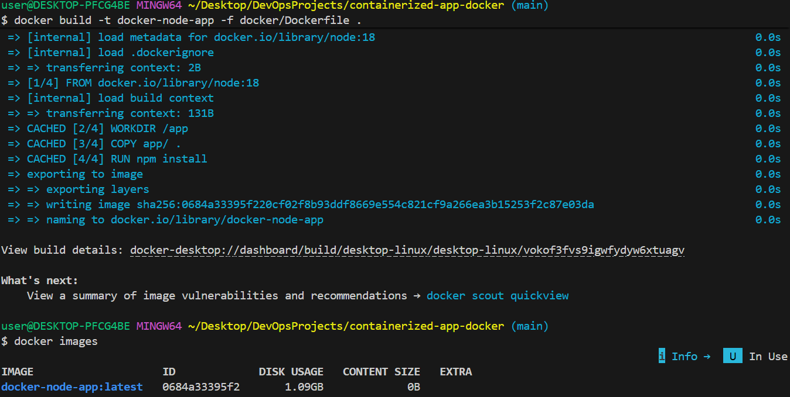
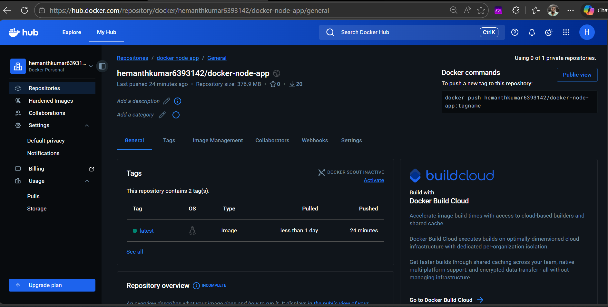

# Containerized Application Deployment with Automated CI/CD

## Project Overview

This project demonstrates how to containerize an application using Docker and automate its build and deployment using GitHub Actions. The pipeline builds the Docker image, pushes it to Docker Hub, and automatically deploys the updated container to an AWS EC2 instance.

The objective is to ensure consistent application environments and enable automated deployments using DevOps best practices.

---

## Problem Statement

Applications often fail to run consistently across different environments due to differences in system configurations, dependencies, and runtime versions.

---

## Solution

Docker is used to package the application and its dependencies into a container image.
A CI/CD pipeline using GitHub Actions automatically builds the Docker image, pushes it to Docker Hub, and deploys it to an AWS EC2 server.

---

## Architecture

Developer → GitHub Repository → GitHub Actions → Docker Hub → AWS EC2 → Running Container → Application Access

---

## Technologies Used

* Docker
* GitHub
* GitHub Actions
* Docker Hub
* AWS EC2
* Linux
* Node.js

---

## Project Structure

containerized-app-docker
│
├── app
│   ├── app.js
│   └── package.json
│
├── docker
│   └── Dockerfile
│
├── .github
│   └── workflows
│       └── deploy.yml
│
├── docs
│   └── architecture.md
│
├── screenshots
│   ├── docker-build.png
│   ├── container-running.png
│   ├── application-running.png
│   └── dockerhub-image.png
│
├── .gitignore
└── README.md

---

## CI/CD Pipeline Workflow

1. Developer pushes application code to GitHub.
2. GitHub Actions pipeline is triggered.
3. The Docker image is built using the Dockerfile.
4. The image is pushed to Docker Hub.
5. GitHub Actions connects to AWS EC2 via SSH.
6. The EC2 instance pulls the latest Docker image.
7. The old container is replaced with the updated container.

---

## Docker Build and Run (Local Development)

Build Docker image:

docker build -t docker-node-app -f docker/Dockerfile .

Run container:

docker run -d -p 3000:3000 docker-node-app

Access application:

http://localhost:3000

---

## Deployment on AWS EC2

The CI/CD pipeline automatically deploys the latest container using the following steps:

docker pull <dockerhub-username>/docker-node-app:latest
docker stop docker-app || true
docker rm docker-app || true
docker run -d -p 80:3000 --name docker-app <dockerhub-username>/docker-node-app:latest

After deployment the application becomes accessible via the EC2 public IP.

Example:

http://EC2-PUBLIC-IP

---

## Screenshots

### Docker Image Build

### Running Container

### Application Running

### Docker Hub Repository

---

## Key Outcomes

* Containerized application using Docker
* Automated CI/CD pipeline using GitHub Actions
* Image storage using Docker Hub
* Automated deployment to AWS EC2
* Consistent application runtime environment

---

## Future Improvements

* Implement Docker image versioning
* Add multi-stage Docker builds
* Integrate monitoring tools
* Deploy using Kubernetes for container orchestration
