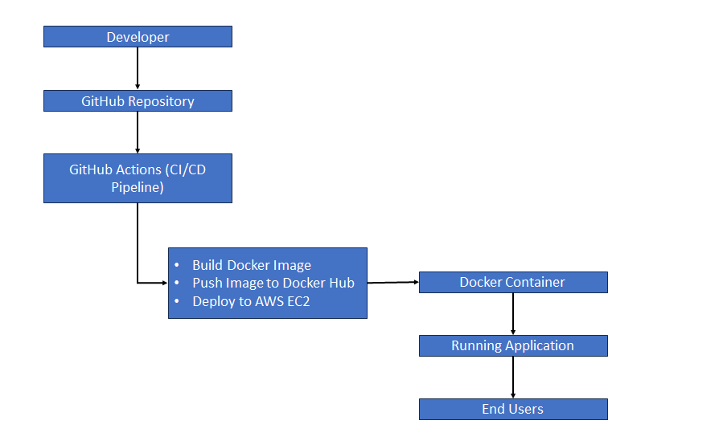
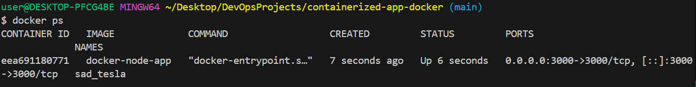
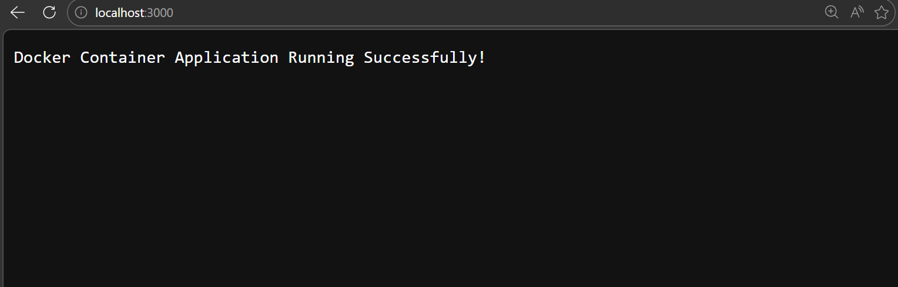
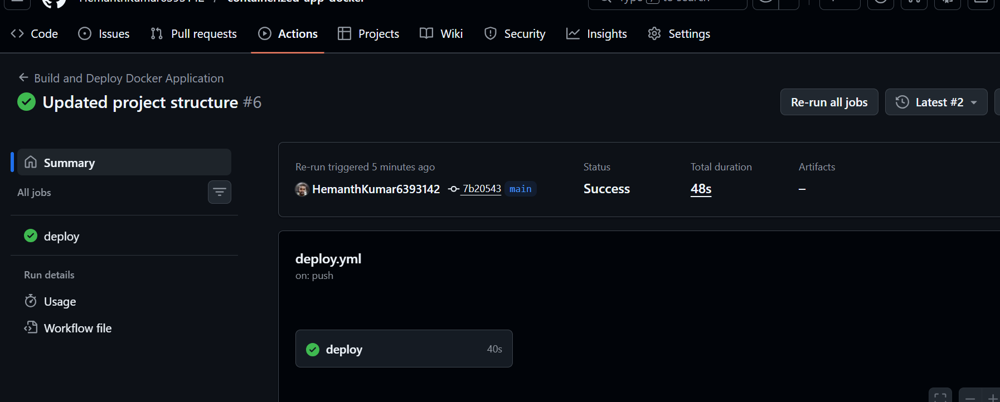
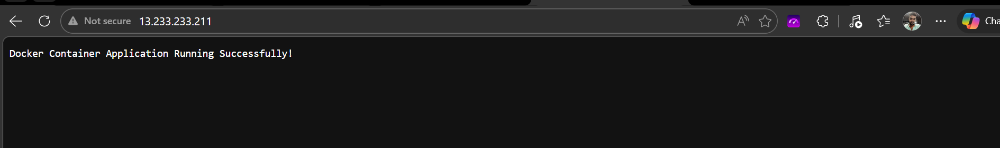

# Automated Containerized Application Deployment using Docker & CI/CD

## 📌 Project Overview

Modern applications require consistent deployment environments and automated delivery mechanisms to ensure reliability and scalability.
This project demonstrates a containerized application deployment pipeline using Docker, GitHub Actions, Docker Hub, and AWS EC2.

The solution simulates a real-world DevOps CI/CD workflow where application changes automatically trigger container build and deployment processes.

---

## 🎯 Problem Statement

In traditional deployment environments:

* Applications fail due to dependency and environment mismatches
* Manual deployments increase operational risk
* Deployment processes are time-consuming and error-prone
* Lack of automation reduces deployment efficiency
* Scaling and updating applications becomes complex

---

## ✅ Solution

Designed and implemented an automated container deployment pipeline that:

* Containerizes the application using Docker
* Automates image build and publishing via GitHub Actions
* Stores container images in Docker Hub registry
* Deploys updated containers automatically to AWS EC2
* Ensures consistent runtime environment across deployments

---

## 🏗️ Architecture

---

## ⚙️ Tech Stack

* Docker
* GitHub
* GitHub Actions
* Docker Hub
* AWS EC2
* Linux
* Node.js

---

## 🚀 Implementation Steps

### 1. Application Containerization

* Developed a simple Node.js application
* Created Dockerfile to package application with dependencies
* Built and tested Docker container locally

### 2. Source Code Management

* Structured project repository with proper documentation
* Maintained Docker configuration and CI/CD workflows in GitHub

### 3. CI Pipeline Automation

* Configured GitHub Actions workflow triggered on code push
* Automated Docker image build process
* Implemented secure Docker Hub authentication using GitHub Secrets

### 4. Image Registry Integration

* Tagged and pushed Docker images to Docker Hub
* Enabled version-controlled image storage and distribution

### 5. Automated Deployment to AWS

* Configured SSH-based deployment from GitHub Actions
* Pulled latest Docker image on EC2 server
* Replaced existing container with updated container version

### 6. Continuous Delivery Workflow

* Enabled seamless application updates via CI/CD pipeline
* Ensured minimal manual intervention in deployment lifecycle

---

## 📸 Project Screenshots

### Docker Image Build

### Running Container

### Application Output

### Docker Hub Repository

### GitHub Actions Pipeline

### EC2 Deployment

---

## 🎯 Key Learnings

* Containerization using Docker
* CI/CD pipeline design using GitHub Actions
* Secure secrets management in GitHub environments
* Automated container deployment strategies
* Container image lifecycle management
* DevOps deployment automation practices

---

## 🔮 Future Improvements

* Implement Docker image versioning strategy
* Add multi-stage Docker builds for optimization
* Integrate monitoring and logging solutions
* Implement blue-green or rolling deployments
* Deploy using Kubernetes for container orchestration
* Add Infrastructure as Code for environment provisioning

---

## 👨‍💻 Author

Hemanth Kumar
